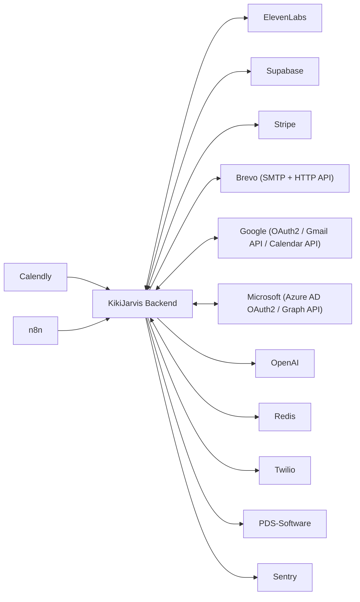

# INTEGRATION & DEPENDENCY MAP — KikiJarvis CRM

*External integrations, their auth, the env vars they need, and failure modes. Generated 2026-06-17.*

## Integration Diagram

## Integrations (13)

| Integration | Direction | Auth | Used By | Failure Mode | Evidence |
|---|---|---|---|---|---|
| **ElevenLabs** | both | xi-api-key header (ELEVENLABS_API_KEY). Inbound tool webhooks authenticated via org_id scoping (resolve_tool_org dep). Inbound post-call via POST_CALL_WEBHOOK_SECRET. | backend/app/services/elevenlabs_agent.py backend/app/services/outbound_call.py backend/app/services/agent_config.py backend/app/services/history_import.py backend/app/api/routes/conversation_init.py backend/app/api/routes/post_call.py backend/app/api/routes/tools/*.py | ElevenLabsWriteError / VerificationFailedError — auto-rollback from snapshot on verify failure. Post-call: non-fatal (logged). Transfer: graceful degradation (speaks number, no bridge). | backend/app/services/elevenlabs_agent.py:34 |
| **Supabase** | both | Backend: service-role key (SUPABASE_SERVICE_ROLE_KEY) bypasses RLS. Frontend: anon key (VITE_SUPABASE_ANON_KEY) with Supabase JWT session tokens. JWT verified via SUPABASE_JWT_SECRET (backend). | backend/app/db/supabase_client.py backend/app/db/realtime.py frontend/src/lib/supabase.ts frontend/src/auth/AuthProvider.tsx | RuntimeError at startup if URL/key missing in production. HTTP 500 on query failure. Frontend: auth state cleared, redirect to /login. | backend/app/db/supabase_client.py:1 |
| **Stripe** | both | STRIPE_SECRET_KEY (sk_test_* / sk_live_*). Webhook signature verification via STRIPE_WEBHOOK_SECRET. Entire router only mounted when STRIPE_BILLING_ENABLED=1. | backend/app/services/stripe_billing.py backend/app/services/stripe_webhook.py backend/app/services/stripe_provisioning.py backend/app/services/stripe_catalog.py backend/app/services/stripe_matcher.py backend/app/services/stripe_admin_actions.py backend/app/services/billing_usage.py backend/app/api/routes/billing.py backend/app/api/routes/stripe_webhook.py backend/app/api/routes/billing_admin.py | StripeConfigError / StripeBillingError on API error. ConnectAttributionError blocks writes to legacy Connect subs. Pinned to stripe==11.6.0 (pre-v12) due to usage-records API incompatibility. | backend/app/services/stripe_billing.py:1 |
| **Brevo (SMTP + HTTP API)** | outbound | BREVO_SMTP_KEY for SMTP relay (smtp-relay.brevo.com:587). BREVO_API_KEY for HTTP API (api.brevo.com/v3) as tier-3 fallback (Railway blocks outbound SMTP 587). | backend/app/services/email_send.py backend/app/core/config.py | Tier-3 fallback in 3-tier chain (Gmail OAuth -> customer SMTP -> Brevo). If all tiers fail, exception re-raised to caller. Failure logged but never silently swallowed. | backend/app/services/email_send.py:1 |
| **Google (OAuth2 / Gmail API / Calendar API)** | both | OAuth2 authorization code flow. GOOGLE_CLIENT_ID + GOOGLE_CLIENT_SECRET. Access tokens refreshed automatically via oauth_tokens.get_valid_access_token(). Stored encrypted in oauth_connections. | backend/app/services/oauth_providers.py backend/app/services/oauth_tokens.py backend/app/services/email_send.py backend/app/services/calendar_sync.py backend/app/api/routes/oauth.py backend/app/api/routes/calendar_settings.py | OAuthTokenError when no valid connection. Calendar sync failure is non-fatal (logged). Email: falls through to next tier in 3-tier chain. | backend/app/services/oauth_providers.py:33 |
| **Microsoft (Azure AD OAuth2 / Graph API)** | both | OAuth2 authorization code flow via login.microsoftonline.com/common. MS_CLIENT_ID + MS_CLIENT_SECRET. Scopes: Mail.Send + Calendars.ReadWrite. | backend/app/services/oauth_providers.py backend/app/services/oauth_tokens.py backend/app/services/email_send.py backend/app/api/routes/oauth.py | OAuthTokenError when token expired/missing. Email send falls through to next tier. | backend/app/services/oauth_providers.py:46 |
| **Calendly** | inbound | OAuth2 via auth.calendly.com. CALENDLY_CLIENT_ID + CALENDLY_CLIENT_SECRET. Calendar-only (no email). Token stored in oauth_connections. | backend/app/services/oauth_providers.py backend/app/services/oauth_tokens.py backend/app/api/routes/oauth.py backend/app/api/routes/calendar_settings.py | OAuthTokenError when no connection. Calendar-only integration — no email fallback path. | backend/app/services/oauth_providers.py:61 |
| **OpenAI** | outbound | OPENAI_API_KEY. Router only mounted when COPILOT_ENABLED=1. Model configurable via OPENAI_COPILOT_MODEL (default gpt-4o) and OPENAI_CLASSIFIER_MODEL (default gpt-4o-mini). Monthly cost cap via ai_usage_log. | backend/app/services/ai/client.py backend/app/services/ai/usage.py backend/app/services/copilot/orchestrator.py backend/app/services/copilot/tools.py backend/app/services/conversation_logic_ai.py backend/app/services/appointment_classifier.py | Client disabled (no-op) when API key not set. Timeout after OPENAI_TIMEOUT_SECONDS (default 30s). Spend cap enforced per-org. | backend/app/services/ai/client.py:1 |
| **Redis** | both | REDIS_URL (connection string includes password). Lazy-initialized: disabled entirely when REDIS_URL is empty. Org-scoped keys only. | backend/app/core/cache.py backend/app/services/ratelimit.py | Fail-open: any Redis error is a cache miss / no-op. Never breaks a request. Single-flight stampede guard with lock TTL. | backend/app/core/cache.py:1 |
| **Twilio** | outbound | TWILIO_ACCOUNT_SID + TWILIO_AUTH_TOKEN (basic auth to api.twilio.com). For outbound calls: ElevenLabs orchestrates via its native Twilio integration (no direct Twilio dial). For transfer: direct TwiML redirect via REST. | backend/app/services/transfer.py backend/app/services/outbound_call.py backend/app/services/agent_config.py backend/app/api/routes/kiki_zentrale.py | Graceful degradation on transfer: if creds or call_sid missing, speaks number to caller but does not bridge. Logged with reason. OutboundCallError on ElevenLabs/Twilio integration failure. | backend/app/services/transfer.py:36 |
| **n8n** | inbound | POST_CALL_WEBHOOK_SECRET / MASTER_WEBHOOK_SECRET (X-HeyKiki-Secret or Authorization header). n8n forwards ElevenLabs post-call payloads to /api/elevenlabs/post-call and triggers /api/outbound/run-due-reminders. | backend/app/api/routes/post_call.py backend/app/api/routes/outbound.py backend/app/services/post_call.py | Body shape normalized (ElevenLabs envelope / flat / N8N item array). Deduplication prevents double-processing on n8n retries. PDS routes provide native replacement for n8n PDS workflows. | backend/app/main.py:169 |
| **PDS-Software** | outbound | Bearer token stored Fernet-encrypted in pds_configs.api_key. Per-org api_url. Ported from n8n workflows. | backend/app/services/pds.py backend/app/api/routes/pds.py backend/app/services/post_call.py | Non-fatal: PDS failure never breaks call processing. best-effort on post-call auto-sync. Errors recorded in pds_sync_log. | backend/app/services/pds.py:1 |
| **Sentry** | outbound | SENTRY_DSN environment variable. Lazy-initialized at startup only when DSN is set. | backend/app/main.py | Dormant (no-op) when SENTRY_DSN not set. Init failure logged as warning but never blocks boot. | backend/app/main.py:70 |

## Environment Variables (47 — 10 required)

| Env Var | Used For | Required |
|---|---|---|
| `APP_ENV` | Deployment environment flag. 'production' enables fail-fast startup validation and Sentry prod tag. | — |
| `SUPABASE_URL` | Supabase project REST endpoint. Required in production. | ✅ |
| `SUPABASE_SERVICE_ROLE_KEY` | Supabase service-role key (bypasses RLS). Backend only. Required in production. | ✅ |
| `SUPABASE_JWT_SECRET` | Supabase JWT signing secret for verifying user Bearer tokens on backend routes. | ✅ |
| `MASTER_WEBHOOK_SECRET` | Shared secret guarding /api/heykiki/provision and super-admin routes. Must be set in production. | ✅ |
| `POST_CALL_WEBHOOK_SECRET` | Shared secret guarding /api/elevenlabs/post-call and /api/outbound/run-due-reminders (X-HeyKiki-Secret). | ✅ |
| `JWKS_TTL_SECONDS` | TTL for cached Supabase JWKS (default 300s). Controls how quickly a rotated signing key stops being trusted. | — |
| `CORS_ORIGINS` | Comma-separated list of allowed CORS origins (e.g., frontend URL). Default: http://localhost:5173. | — |
| `ELEVENLABS_API_KEY` | ElevenLabs xi-api-key for agent config reads/writes, KB management, and history import. | ✅ |
| `TWILIO_ACCOUNT_SID` | Twilio Account SID for live call transfer (TwiML redirect). Optional — graceful degradation without it. | — |
| `TWILIO_AUTH_TOKEN` | Twilio Auth Token (paired with TWILIO_ACCOUNT_SID). Optional. | — |
| `OPENAI_API_KEY` | OpenAI API key for copilot + classifiers. Dormant when not set. | — |
| `COPILOT_ENABLED` | Feature flag (0/1) — mounts the /api/copilot router and shows copilot widget. Default 0. | — |
| `OPENAI_COPILOT_MODEL` | OpenAI model for copilot completions. Default: gpt-4o. | — |
| `OPENAI_CLASSIFIER_MODEL` | OpenAI model for cheap classifiers (emergency detection, employee auto-assign). Default: gpt-4o-mini. | — |
| `OPENAI_TIMEOUT_SECONDS` | Network timeout for OpenAI API calls. Default: 30.0s. | — |
| `COPILOT_MONTHLY_COST_CAP_USD` | Soft per-org monthly OpenAI spend cap in USD. 0 = no cap. Default: 25.0. | — |
| `SETTINGS_ENC_KEY` | Fernet symmetric encryption key for storing third-party credentials (OAuth tokens, PDS API keys, customer SMTP passwords). | ✅ |
| `GOOGLE_CLIENT_ID` | Google OAuth2 client ID for Gmail + Calendar integration. | — |
| `GOOGLE_CLIENT_SECRET` | Google OAuth2 client secret. | — |
| `MS_CLIENT_ID` | Microsoft Azure AD OAuth2 client ID for Outlook/Graph integration. | — |
| `MS_CLIENT_SECRET` | Microsoft Azure AD OAuth2 client secret. | — |
| `CALENDLY_CLIENT_ID` | Calendly OAuth2 client ID for calendar sync. | — |
| `CALENDLY_CLIENT_SECRET` | Calendly OAuth2 client secret. | — |
| `BACKEND_PUBLIC_URL` | Publicly reachable backend URL (used to build OAuth redirect URIs registered with Google/Azure). Default: http://localhost:8000. | — |
| `FRONTEND_PUBLIC_URL` | Public frontend URL for employee set-password links and billing portal return URL. Must be on Supabase Auth redirect allow-list. | — |
| `BREVO_SMTP_KEY` | Brevo SMTP relay API key (read as BREVO_SMTP_KEY env var). Tier-3 email fallback. | — |
| `BREVO_SMTP_FROM_ADDRESS` | From address for Brevo SMTP emails. Default: info@kiki-zusammenfassung.de. | — |
| `BREVO_API_KEY` | Brevo transactional HTTP API key for /v3/smtp/email (used when SMTP 587 is blocked by Railway). | — |
| `REDIS_URL` | Redis connection URL (includes password). Activates caching and rate limiting. Dormant when empty. | — |
| `CACHE_PREFIX` | Redis key namespace prefix to prevent collisions between environments sharing one Redis. Default: kj. | — |
| `OBSERVABILITY_ENABLED` | Feature flag (0/1) — enables structured JSON logging + request-context middleware. Default 0. | — |
| `OUTBOUND_TEST_SCOPE_ONLY` | Safety guard (default 1=ON). Forces all outbound calls/emails to test numbers/addresses only. Set to 0 for go-live. | — |
| `OUTBOUND_TEST_NUMBER` | Override destination for outbound calls when scope guard is ON. Default: +917879997839. | — |
| `OUTBOUND_TEST_EMAIL` | Override destination for outbound emails when scope guard is ON. Default: agrawalamber01@gmail.com. | — |
| `OUTBOUND_TEST_ORG_IDS` | Comma-separated org UUIDs allowed to use outbound when scope guard is ON. | — |
| `OUTBOUND_OCCASION_EMAILS_ENABLED` | Feature flag (0/1) — enables emails attached to outbound calling occasions. Default 0. | — |
| `STRIPE_SECRET_KEY` | Stripe secret API key (sk_test_* or sk_live_*). Billing disabled when empty. Live key triggers additional validation. | — |
| `STRIPE_WEBHOOK_SECRET` | Stripe webhook signing secret (whsec_*) for verifying incoming events. Required if using live Stripe key. | — |
| `STRIPE_BILLING_ENABLED` | Feature flag (0/1) — mounts billing router (billing, billing_admin, stripe_webhook). Default 0. | — |
| `STRIPE_USAGE_REPORTING_ENABLED` | Feature flag (0/1) — enables per-call Stripe usage reporting. Requires STRIPE_BILLING_ENABLED=1. Default 0. | — |
| `BILLING_PORTAL_RETURN_URL` | Return URL for Stripe billing portal session. Falls back to FRONTEND_PUBLIC_URL + /settings/abrechnung. | — |
| `SENTRY_DSN` | Sentry DSN for error tracking. Dormant when not set — zero behavior change without it. | — |
| `VITE_API_URL` | Frontend: backend API base URL baked into the Vite build. Default: https://backend-production-3f88a.up.railway.app. | ✅ |
| `VITE_SUPABASE_URL` | Frontend: Supabase project URL baked into Vite build for @supabase/supabase-js client. | ✅ |
| `VITE_SUPABASE_ANON_KEY` | Frontend: Supabase anon (publishable) key baked into Vite build. | ✅ |
| `VITE_COPILOT_ENABLED` | Frontend: build-time flag (0/1) to show/hide the copilot widget. Default 1 in prod builds. | — |

