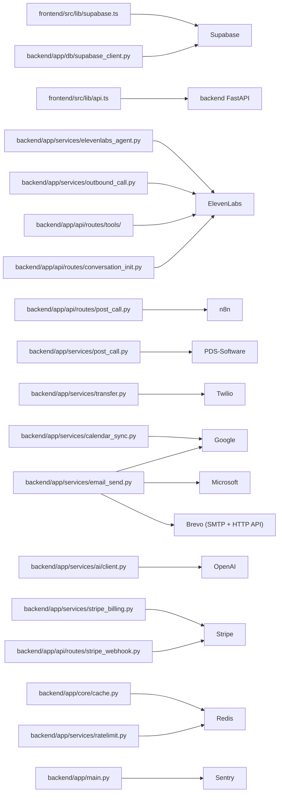

# REPOSITORY MAP — KikiJarvis CRM

*Structure, modules, tables, dependencies and data flows. Generated 2026-06-17.*

## Repository Structure

| Path | Role | Key Files |
|---|---|---|
| `backend/` | FastAPI Python backend (Python 3.12, uvicorn/gunicorn). All business logic, ElevenLabs agent integration, post-call processing, outbound orchestration, billing, and third-party integrations. | backend/app/main.py backend/app/core/config.py backend/app/db/supabase_client.py backend/requirements.txt |
| `frontend/` | Vite + React 19 SPA. German-only UI, Supabase auth, React Query v5 for server state, Tailwind + Radix UI components, recharts for dashboards, FullCalendar for appointments. | frontend/src/main.tsx frontend/src/App.tsx frontend/src/lib/supabase.ts frontend/src/lib/api.ts frontend/src/lib/env.ts frontend/Dockerfile frontend/package.json |
| `supabase/migrations/` | 73 numbered SQL migrations applied to Supabase (PostgreSQL). Defines all schema: tables, RLS policies, indexes. | supabase/migrations/0001_init_schema.sql supabase/migrations/0015_kiki_zentrale.sql supabase/migrations/0056_cases.sql supabase/migrations/0073_case_project_split.sql |
| `backend/app/api/routes/` | FastAPI routers — one file per domain. Includes a tools/ sub-directory for 11 ElevenLabs agent tool webhook handlers. | backend/app/api/routes/post_call.py backend/app/api/routes/conversation_init.py backend/app/api/routes/outbound.py backend/app/api/routes/pds.py backend/app/api/routes/stripe_webhook.py |
| `backend/app/services/` | Business-logic layer. Every route delegates to a service function here. Sub-dirs: ai/ (OpenAI copilot), cases/ (LLM grouper), copilot/ (orchestrator + tools). | backend/app/services/elevenlabs_agent.py backend/app/services/post_call.py backend/app/services/outbound_call.py backend/app/services/email_send.py backend/app/services/calendar_sync.py backend/app/services/pds.py backend/app/services/stripe_billing.py backend/app/services/provisioning.py backend/app/services/transfer.py |
| `backend/app/core/` | Cross-cutting infrastructure: config (Pydantic Settings), Redis cache, Fernet crypto, logging/observability middleware. | backend/app/core/config.py backend/app/core/cache.py backend/app/core/crypto.py |
| `CRM_EVALUATION_AUDIT/` | Architecture audit artefacts. _data/ holds machine-readable maps (this file). rules/ for audit rules. | CRM_EVALUATION_AUDIT/_data/repo_map.json |
| `scripts/` | One-off operational scripts (history import, backfills, etc.). |  |
| `n8n_heykiki_provision.json` | n8n workflow export — legacy automation blueprint for provisioning and post-call forwarding (superseded by native backend routes). |  |

## Backend Modules

| Area | Routes | Services |
|---|---|---|
| Core infrastructure | GET / GET /api/health | app.core.config app.core.cache app.core.crypto app.core.logging_config app.core.observability app.db.supabase_client |
| Provisioning & super-admin | POST /api/heykiki/provision GET\|POST /api/super-admin/orgs POST /api/super-admin/orgs/{id}/import-history | app.services.provisioning app.services.history_import app.services.agent_config |
| ElevenLabs agent webhooks (inbound call flow) | POST /api/elevenlabs/conversation-init POST /api/elevenlabs/post-call POST /api/tools/identify-customer POST /api/tools/update-customer POST /api/tools/create-inquiry POST /api/tools/get-available-slots POST /api/tools/book-appointment POST /api/tools/cancel-appointment POST /api/tools/change-appointment POST /api/tools/search-inquiries POST /api/tools/query-knowledge-base POST /api/tools/transfer-call POST /api/tools/draft-cost-estimate | app.services.conversation_init app.services.post_call app.services.identify app.services.inquiries app.services.scheduling app.services.appointments app.services.knowledge app.services.transfer app.services.cost_estimates app.services.elevenlabs_agent |
| Outbound calling | POST /api/outbound/run-due-reminders POST /api/outbound/send | app.services.outbound_call app.services.outbound_dispatch app.services.outbound_occasions app.services.outbound_scope |
| Calls & inquiries | GET /api/calls GET /api/calls/{id} DELETE /api/calls/{id} GET /api/inquiries GET /api/inquiries/{id} POST /api/inquiries PATCH /api/inquiries/{id} | app.services.inquiries |
| Cases | GET /api/cases POST /api/cases PATCH /api/cases/{id} DELETE /api/cases/{id} GET /api/cases/{id}/jobs POST /api/cases/group POST /api/cases/apply | app.services.cases.grouper app.services.cases.apply_run app.services.cases.dryrun |
| Customers | GET /api/customers GET /api/customers/{id} POST /api/customers PATCH /api/customers/{id} | app.services.customers app.services.csv_import |
| Appointments & calendar | GET /api/appointments POST /api/appointments PATCH /api/appointments/{id} DELETE /api/appointments/{id} POST /api/calendar-settings/sync-google | app.services.appointments app.services.scheduling app.services.calendar_sync app.services.appointment_notify app.services.appointment_emails app.services.appointment_classifier |
| Projects | GET /api/projects POST /api/projects GET /api/projects/{id} PATCH /api/projects/{id} DELETE /api/projects/{id} | app.services.projects app.services.projects_auto |
| Planning board | GET /api/planning-board PATCH /api/planning-board/assignments |  |
| Cost estimates & invoices | GET /api/cost-estimates POST /api/cost-estimates GET /api/invoices POST /api/invoices | app.services.cost_estimates app.services.invoices |
| Catalog & text modules | GET /api/catalog POST /api/catalog/items GET /api/text-modules POST /api/text-modules | app.services.stripe_catalog |
| Employees & users | GET /api/employees POST /api/employees PATCH /api/employees/{id} GET /api/users/me POST /api/users/invite | app.services.employee_invite |
| Kiki-Zentrale (agent config UI) | GET /api/kiki-zentrale/config PATCH /api/kiki-zentrale/config POST /api/kiki-zentrale/knowledge-resources DELETE /api/kiki-zentrale/knowledge-resources/{id} GET /api/kiki-zentrale/agent-health POST /api/kiki-zentrale/rollback/{snapshot_id} | app.services.elevenlabs_agent app.services.agent_config app.services.knowledge app.services.price_knowledge |
| OAuth & email settings | GET /api/settings/oauth/{provider}/authorize GET /api/settings/oauth/{provider}/callback DELETE /api/settings/oauth/{provider} GET /api/settings/email-config PATCH /api/settings/email-config | app.services.oauth_tokens app.services.oauth_providers app.services.email_send |
| Billing (Stripe, gate: STRIPE_BILLING_ENABLED) | GET /api/billing/status POST /api/billing/portal POST /api/stripe-webhook | app.services.stripe_billing app.services.stripe_webhook app.services.stripe_provisioning app.services.stripe_matcher app.services.stripe_admin_actions app.services.billing_usage app.services.billing_notifications |
| PDS integration | POST /api/pds/log-call POST /api/pds/greeting POST /api/pds/create-contact | app.services.pds |
| AI copilot (gate: COPILOT_ENABLED) | POST /api/copilot/message GET /api/copilot/conversations | app.services.copilot.orchestrator app.services.copilot.tools app.services.ai.client app.services.ai.usage |
| Documents & vehicles | GET /api/documents POST /api/documents GET /api/vehicles POST /api/vehicles |  |
| Public / no-auth portals | GET /api/public/jobs/{token} GET /api/public/technician/{token} | app.services.technician_jobs |
| Action suggestions | GET /api/actions POST /api/actions/{id}/apply DELETE /api/actions/{id} |  |
| Dashboard | GET /api/dashboard/overview |  |

## Frontend Modules

| Area | Pages |
|---|---|
| Auth | src/auth/AuthProvider.tsx src/auth/ProtectedRoute.tsx src/pages/LoginPage.tsx src/pages/SetPasswordPage.tsx src/admin/AdminAuthProvider.tsx |
| Dashboard | src/pages/DashboardPage.tsx |
| Call log | src/pages/CallLogsPage.tsx src/pages/PosteingangPage.tsx |
| Customers | src/pages/CustomersPage.tsx src/pages/CustomerDetailPage.tsx |
| Cases (Fälle) | src/pages/CasesPage.tsx src/pages/VorgangThreadPage.tsx |
| Projects | src/pages/ProjectsPage.tsx src/pages/ProjectWorkspacePage.tsx src/pages/ProjectFormPage.tsx |
| Calendar & appointments | src/pages/CalendarPage.tsx src/pages/MyAbsencePage.tsx |
| Planning board | src/pages/PlanningBoardPage.tsx |
| Cost estimates & invoices | src/pages/CostEstimatesPage.tsx src/pages/CostEstimateFormPage.tsx src/pages/InvoicesPage.tsx src/pages/InvoiceFormPage.tsx |
| Catalog | src/pages/CatalogPage.tsx |
| Employees | src/pages/EmployeesPage.tsx |
| Kiki-Zentrale (agent config) | src/pages/KikiZentralePage.tsx src/pages/RufumleitungGuidePage.tsx |
| Settings | src/pages/SettingsPage.tsx |
| Technician portal (public) | src/pages/JobLinkPage.tsx src/pages/TechnicianPortalPage.tsx |
| Super-admin (separate React tree) | src/admin/AdminApp.tsx src/admin/AdminOrgsPage.tsx src/admin/AdminBillingPage.tsx src/admin/AdminOrgFormPage.tsx |
| Copilot widget | src/components/kiki/VerlaufSection.tsx |
| Shared libs | src/lib/api.ts src/lib/supabase.ts src/lib/env.ts src/lib/kikiApi.ts src/lib/dashApi.ts src/lib/datetime.ts |

## Database Tables (52)

| Table | Introduced By | Purpose |
|---|---|---|
| `organizations` | 0001_init_schema.sql | Root tenant table: one row per tradesperson business. Holds ElevenLabs agent_id, org_code, billing fields. |
| `org_secrets` | 0001_init_schema.sql | Per-org encrypted secrets (legacy; main secrets now in env or oauth_connections). |
| `users` | 0001_init_schema.sql | CRM user accounts (org_admin + employees). Linked to Supabase Auth. |
| `customers` | 0001_init_schema.sql | Customer/caller contact records per org. |
| `calls` | 0001_init_schema.sql | Inbound/outbound call records from ElevenLabs. Central CRM event. Enhanced by many later migrations (emergency_flag 0024, deleted_at 0043, pds_synced 0069, is_spam 0071). |
| `inquiries` | 0001_init_schema.sql | Service requests created during a call (ANF- numbered). Linked to calls, customers, cases. |
| `appointments` | 0001_init_schema.sql | Scheduled appointments, slots, and Google Calendar imports (source='google_import' from migration 0033). |
| `cost_estimates` | 0001_init_schema.sql | KVA (Kostenvoranschlag) / cost estimate documents with line items. |
| `invoices` | 0001_init_schema.sql | Invoices linked to customers and projects, with PDF generation. |
| `employees` | 0001_init_schema.sql | Employee records per org with roles, colors, absence tracking. Extended by 0059 (is_technician). |
| `agent_configs` | 0001_init_schema.sql | Per-org Kiki AI agent config: scheduling rules, autonomy level, enabled features. |
| `catalog_items` | 0001_init_schema.sql | Service catalog items with pricing (used for cost estimates and price knowledge base). |
| `ai_suggestions` | 0001_init_schema.sql | AI-generated suggestions for CRM actions (proactive AI). |
| `time_entries` | 0001_init_schema.sql | Time tracking entries for employees. |
| `documents` | 0007_documents.sql | File attachments (PDFs, images) linked to various entities. Stored in Supabase Storage. |
| `employee_absences` | 0008_employee_management.sql | Employee absence records (vacation, sick leave) affecting slot availability. |
| `vehicles` | 0009_planning_board.sql | Fleet vehicles for the planning board. |
| `tools` | 0009_planning_board.sql | Tool/equipment inventory for the planning board. |
| `text_modules` | 0011_catalog_templates.sql | Reusable text snippets for cost estimates, invoices, emails. |
| `projects` | 0013_projects.sql (originally), recreated by 0073_case_project_split.sql | Top-layer project grouping above Cases (PR- numbered). Restored in migration 0073 as a separate layer above cases. |
| `project_employees` | 0013_projects.sql | Many-to-many: project ↔ employee assignments. |
| `email_configs` | 0014_settings_fields.sql | Per-org email sending config: OAuth provider choice or custom SMTP credentials (Fernet-encrypted). |
| `pds_configs` | 0014_settings_fields.sql | PDS-Software ERP integration config: API URL + Bearer key (Fernet-encrypted) per org. |
| `agent_required_fields` | 0015_kiki_zentrale.sql | Ordered list of fields Kiki must capture during a call (name, phone, address, etc.). |
| `appointment_categories` | 0015_kiki_zentrale.sql | Named appointment types per org with duration defaults. |
| `agent_services` | 0015_kiki_zentrale.sql | Services the agent is trained to handle (plumbing, heating, etc.). |
| `knowledge_resources` | 0015_kiki_zentrale.sql | Knowledge base documents (URL/file/text) pushed to ElevenLabs KB. Tracks sync status and elevenlabs_doc_id. |
| `agent_config_snapshots` | 0015_kiki_zentrale.sql | Full ElevenLabs agent config snapshots before every write (enables rollback). |
| `agent_writes_audit` | 0015_kiki_zentrale.sql | Audit log of every ElevenLabs agent config mutation: diff, HTTP status, rollback flag. |
| `ai_suggestion_actions` | 0016_ai_suggestion_actions.sql | Structured actions attached to AI suggestions (e.g., create appointment, update customer). |
| `outbound_calls` | 0029_outbound_calls.sql | Ledger for outbound call dispatches — idempotency guard prevents double-dialing. |
| `maintenance_plans` | 0031_maintenance_plans.sql | Recurring service maintenance plan records per customer. |
| `missed_calls` | 0032_missed_calls.sql | Calls that went unanswered, for follow-up tracking. |
| `oauth_connections` | 0028_oauth_connections.sql | Stored OAuth tokens (Google/Microsoft/Calendly) per org. Refresh tokens encrypted at rest. |
| `oauth_purpose_links` | 0034_oauth_purpose_links.sql | Links an oauth_connection to a purpose (email, calendar) enabling multi-provider routing. |
| `copilot_conversations` | 0042_ai_copilot.sql (recreated by 0062_copilot_conversations.sql) | AI copilot session threads per org/user. |
| `copilot_messages` | 0042_ai_copilot.sql (recreated by 0062_copilot_conversations.sql) | Individual messages within a copilot conversation (user + assistant turns). |
| `copilot_action_audit` | 0042_ai_copilot.sql | Audit log of copilot-initiated CRM mutations. |
| `copilot_escalations` | 0042_ai_copilot.sql | Cases where the copilot escalated to a human operator. |
| `ai_usage_log` | 0042_ai_copilot.sql | Per-org AI spend ledger (tokens * cost) enforcing monthly cap (COPILOT_MONTHLY_COST_CAP_USD). |
| `action_tasks` | 0054_action_tasks.sql | Scheduled/deferred action tasks triggered by agent suggestions or outbound occasions. |
| `case_links` | 0055_vorgang_threading.sql | Many-to-many links between calls/inquiries and cases for the Vorgang threading view. |
| `cases` | 0056_cases.sql | Case records (FL- numbered). The core CRM ticket: groups calls + inquiries under a customer. Renamed from former projects table in migration 0073. |
| `billing_events` | 0048_billing.sql | Write ledger for every Stripe mutation (audit-first model, like agent_writes_audit). |
| `billing_webhook_events` | 0048_billing.sql | Received Stripe webhook events for idempotency and audit. |
| `billing_usage_reports` | 0048_billing.sql | Per-call Stripe usage records (idempotent by call_id). |
| `billing_migration_log` | 0048_billing.sql | Log of subscription migration steps when moving orgs between Stripe plans. |
| `billing_security_events` | 0048_billing.sql | Security-sensitive billing events (cross-org guard violations, etc.). |
| `billing_notifications` | 0049_billing_phase2.sql | In-app billing alert records (80% usage warning, plan upgrade prompts). |
| `billing_checkout_sessions` | 0049_billing_phase2.sql | Stripe Checkout session records for plan upgrades. |
| `technician_job_links` | 0064_technician_job_links.sql | Token-secured job links sent to field technicians (no login required — token IS the credential). |
| `pds_sync_log` | 0070_pds_sync_log.sql | Log of PDS-Software sync attempts (call log push, contact create) with status and error details. |

## Module Relationship Diagram

### Dependency Edges

| From | To | Reason |
|---|---|---|
| frontend/src/lib/supabase.ts | Supabase | Auth sessions (anon key + JWT). Two clients: heykiki-customer-auth + heykiki-admin-auth storage keys. |
| frontend/src/lib/api.ts | backend FastAPI | All CRM data reads/writes via VITE_API_URL + Supabase JWT Bearer token. |
| backend/app/db/supabase_client.py | Supabase | Service-role client for all DB operations. HTTP/1.1 forced for thread-safe concurrent fan-out. |
| backend/app/services/elevenlabs_agent.py | ElevenLabs | Agent config CRUD, knowledge base management, health probes via xi-api-key REST. |
| backend/app/services/outbound_call.py | ElevenLabs | POST /v1/convai/twilio/outbound-call to place outbound calls via ElevenLabs-Twilio bridge. |
| backend/app/api/routes/tools/ | ElevenLabs | Tool webhook handlers called by ElevenLabs agent during active calls. |
| backend/app/api/routes/conversation_init.py | ElevenLabs | Conversation initiation webhook — ElevenLabs calls this on call connect to get per-org config. |
| backend/app/api/routes/post_call.py | n8n | n8n forwards ElevenLabs post-call payload here after call ends. |
| backend/app/services/post_call.py | PDS-Software | Auto-sync call log to PDS after processing (best-effort, non-fatal). |
| backend/app/services/transfer.py | Twilio | Direct Twilio REST API call to redirect live inbound call TwiML to human number. |
| backend/app/services/email_send.py | Google | Tier-1 email: Gmail API via OAuth access token. |
| backend/app/services/email_send.py | Microsoft | Tier-1 email: Microsoft Graph API via OAuth access token. |
| backend/app/services/email_send.py | Brevo (SMTP + HTTP API) | Tier-3 fallback email relay when org has no OAuth or custom SMTP configured. |
| backend/app/services/calendar_sync.py | Google | Read-only pull of Google primary calendar events into appointments table. |
| backend/app/services/ai/client.py | OpenAI | Copilot chat completions and tool calls. Classifiers for emergency detection and employee auto-assign. |
| backend/app/services/stripe_billing.py | Stripe | Subscription reads, usage records, billing portal sessions, customer management. |
| backend/app/api/routes/stripe_webhook.py | Stripe | Receives Stripe webhook events (subscription created/updated/deleted, invoice paid). |
| backend/app/core/cache.py | Redis | Org-scoped caching for read-heavy endpoints. Fail-open: disabled when REDIS_URL not set. |
| backend/app/services/ratelimit.py | Redis | Per-org rate limiting using Redis counters. |
| backend/app/main.py | Sentry | Error tracking for unhandled exceptions. Dormant until SENTRY_DSN set. |

## Data Flows

- **Inbound call: caller rings → inquiry created:** 1. Caller dials Twilio number linked to ElevenLabs agent. → 2. ElevenLabs fires GET /api/elevenlabs/conversation-init → backend looks up org by phone number, returns per-org config (business hours, first message, agent prompt override). → 3. ElevenLabs conducts conversation; each tool call hits /api/tools/* webhook endpoints (identify-customer, create-inquiry, book-appointment, etc.). → 4. Call ends → ElevenLabs notifies n8n with post-call payload. → 5. n8n forwards to POST /api/elevenlabs/post-call (secret-protected). → 6. post_call.py normalizes payload, inserts/updates call row in Supabase, links inquiry, creates missed_call if needed. → 7. If org has PDS config: best-effort sync of call log to PDS-Software via pds.py. → 8. If STRIPE_USAGE_REPORTING_ENABLED: background task reports call duration to Stripe usage records. → 9. Appointment notification emails sent if appointment was booked (email_send.py 3-tier chain).  _(integrations: ElevenLabs, n8n, Supabase, PDS-Software, Stripe, Brevo (SMTP + HTTP API))_
- **Outbound call: occasion-driven reminder:** 1. Cron / n8n fires POST /api/outbound/run-due-reminders (secret-protected). → 2. outbound_dispatch.py scans outbound-enabled orgs for due occasions (appointment_reminder, kva_followup, etc.). → 3. Scope guard: if OUTBOUND_TEST_SCOPE_ONLY=1, only allowed org IDs can proceed; real numbers replaced by test number. → 4. outbound_call.py POSTs to ElevenLabs /v1/convai/twilio/outbound-call with per-call dynamic variables + prompt override. → 5. ElevenLabs + Twilio places the call; conversation_id written to outbound_calls ledger. → 6. Call ends → post-call flow (same as inbound) processes the conversation. → 7. Optional occasion email (OUTBOUND_OCCASION_EMAILS_ENABLED) sent in parallel via email_send.py.  _(integrations: ElevenLabs, Twilio, n8n, Supabase, Brevo (SMTP + HTTP API))_
- **Agent configuration (Kiki-Zentrale):** 1. Org admin edits config in KikiZentralePage (first message, prompt, voice, business hours, knowledge resources). → 2. Frontend POSTs to /api/kiki-zentrale/config. → 3. Backend calls patch_agent_safely(): cross-org guard → snapshot to agent_config_snapshots → deep-merge → audio assertion → PATCH ElevenLabs REST → post-write verify → audit to agent_writes_audit. → 4. On verify failure: automatic rollback to snapshot + VerificationFailedError returned. → 5. Knowledge resources: uploaded to Supabase Storage → pushed to ElevenLabs KB API → doc_id stored in knowledge_resources.  _(integrations: ElevenLabs, Supabase)_
- **Call transfer (emergency / staff):** 1. ElevenLabs agent detects transfer intent and calls /api/tools/transfer-call. → 2. transfer.py reads emergency_number / incoming_forwarding_number from agent_configs. → 3. If Twilio creds + call_sid present: Twilio REST API redirects live call TwiML to human number. → 4. Returns success + transfer message regardless (graceful degradation if Twilio not configured).  _(integrations: ElevenLabs, Twilio, Supabase)_
- **Email send (3-tier chain):** 1. Trigger: appointment confirmation, KVA PDF, invoice, employee invite. → 2. Tier 1: if org has Google OAuth → Gmail API send. → 3. Tier 2: if org has Microsoft OAuth → Microsoft Graph API send. → 4. Tier 3: if org has customer SMTP → smtplib SMTP (Fernet-decrypt password). → 5. Tier 4 (HeyKiki fallback): Brevo HTTP API (api.brevo.com/v3) — Railway blocks outbound SMTP 587.  _(integrations: Google, Microsoft, Brevo (SMTP + HTTP API), Supabase)_
- **Google Calendar sync:** 1. Org admin triggers sync from SettingsPage → POST /api/calendar-settings/sync-google. → 2. calendar_sync.py fetches OAuth token (auto-refresh via oauth_tokens.py). → 3. Google Calendar API: GET primary calendar events for 60-day forward window. → 4. Events upserted into appointments table (source='google_import') to block AI slot finder. → 5. Deleted events → status='cancelled' to free slots.  _(integrations: Google, Supabase)_
- **Org provisioning:** 1. Super-admin POSTs to /api/heykiki/provision (MASTER_WEBHOOK_SECRET required). → 2. provisioning.py: creates organization row, seeds agent_configs with defaults, creates required_fields. → 3. agent_config.py: configures ElevenLabs agent (webhook URL, tool IDs, override flags, language). → 4. Background: history_import.py fetches historical ElevenLabs conversations and backfills calls table. → 5. Optional Stripe: stripe_provisioning.py links org to Stripe customer.  _(integrations: ElevenLabs, Supabase, Stripe)_
- **Stripe billing lifecycle:** 1. Customer visits /settings/abrechnung → GET /api/billing/status (reads Stripe subscription). → 2. Upgrade: POST /api/billing/portal → Stripe Billing Portal session URL → redirect. → 3. Stripe webhook: POST /api/stripe-webhook (signature verified) → stripe_webhook.py updates org billing fields in Supabase. → 4. Per-call usage: post-call hook triggers billing_usage.report_call_usage → Stripe usage record. → 5. 80% warning: billing_notifications inserted → frontend billing banner.  _(integrations: Stripe, Supabase)_
- **PDS-Software sync (post-call):** 1. post_call.py finishes inserting call row. → 2. If org has pds_configs row: pds.sync_call_to_pds() called (best-effort, non-fatal). → 3. pds.py decrypts Bearer token from pds_configs, calls PDS API: person/listpersonen (lookup by phone) → crm/createaufgabe (log call task). → 4. Result (success/error) written to pds_sync_log.  _(integrations: PDS-Software, Supabase)_
- **AI copilot (Kiki Assistent):** 1. User types message in copilot widget (VITE_COPILOT_ENABLED=1 + COPILOT_ENABLED=1). → 2. POST /api/copilot/message → copilot/orchestrator.py. → 3. OpenAI gpt-4o completion with tool definitions (read/write CRM data). → 4. Tool calls: copilot/tools.py executes CRM actions (create inquiry, update customer, etc.), audited in copilot_action_audit. → 5. Response + actions streamed back. ai_usage_log updated. Monthly cap checked.  _(integrations: OpenAI, Supabase)_

