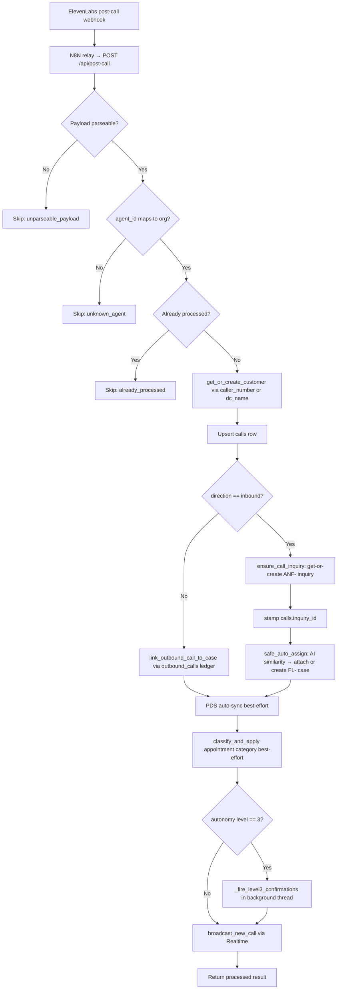
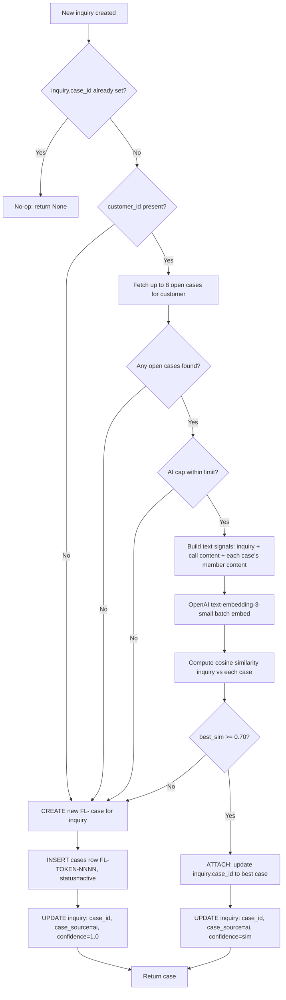
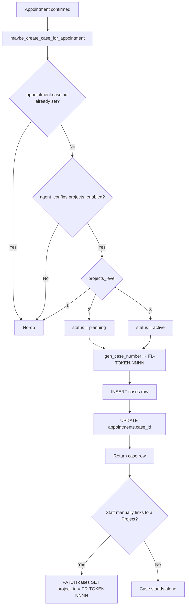
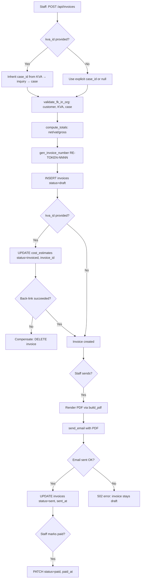
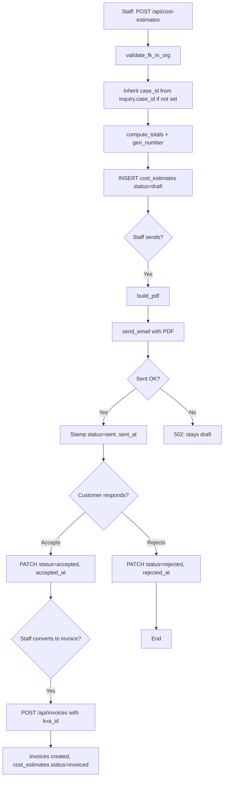
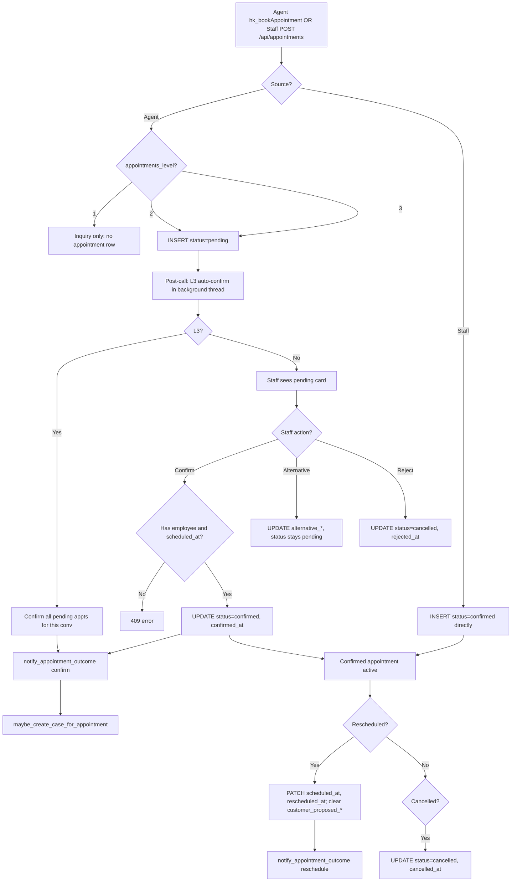
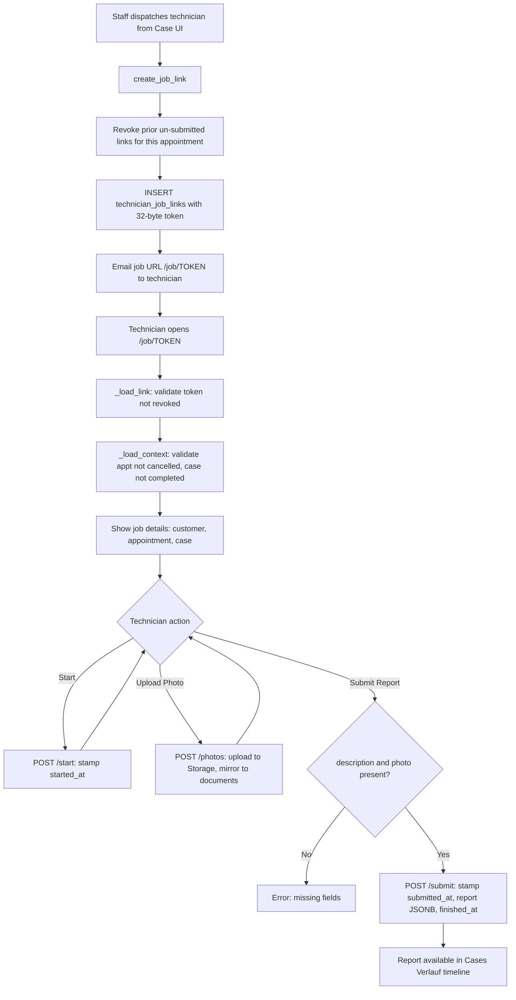
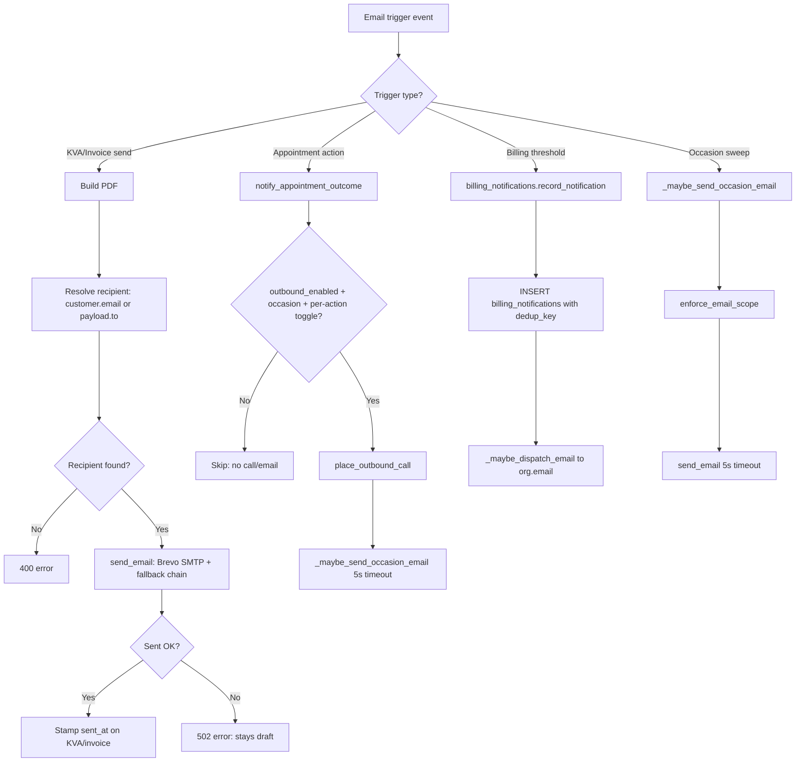
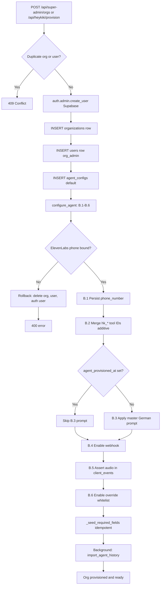
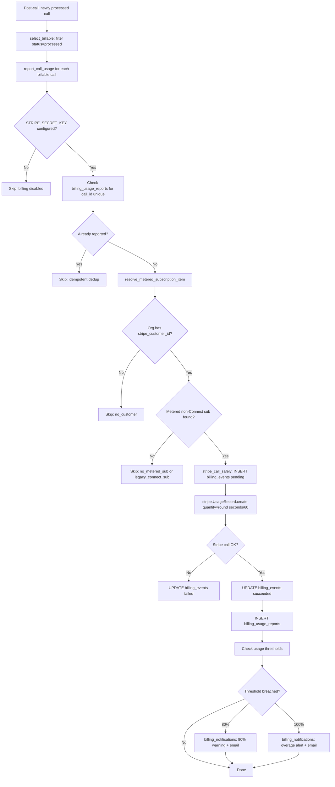

# WORKFLOW DIAGRAMS — KikiJarvis CRM

*End-to-end workflow traces with Mermaid flowcharts. Generated 2026-06-17 from code-path analysis.*

## Index

1. Inbound Call → Inquiry (ANF)
2. Inquiry → Case (FL) Linkage / Grouping
3. Case (FL) → Project (PR)
4. Project → Invoice → Payment
5. Cost Estimate (KVA) → Invoice
6. Appointment Lifecycle: Create → Assign → Confirm → Reschedule → Cancel
7. Technician Dispatch (Case Jobs → Technician Portal)
8. Outbound Occasion Call Dispatch + Scope Gate
9. Email / Notification Triggers
10. Org Onboarding / Agent Provisioning (Super-Admin → configure_agent → ElevenLabs)
11. Copilot Action → Confirm → Apply
12. Stripe Billing / Usage → Warning / Overage


---

## 1. Inbound Call → Inquiry (ANF)



| Aspect | Detail |
|---|---|
| **Trigger** | ElevenLabs post-call webhook received by N8N, forwarded to POST /api/post-call (x-heykiki-secret auth) |
| **Inputs** | conversation_id<br>agent_id<br>transcript (array of turns)<br>metadata.phone_call.external_number (caller_number)<br>metadata.phone_call.direction<br>analysis.data_collection_results<br>analysis.transcript_summary<br>analysis.call_summary_title<br>metadata.start_time_unix_secs |
| **Conditions** | agent_id must resolve to a known organization (organizations.elevenlabs_agent_id)<br>direction must be 'inbound' to spawn an inquiry (outbound skips ensure_call_inquiry)<br>conversation_id unique per org (upsert on conflict)<br>call not already_processed (status=completed AND summary/transcript present)<br>customer linked only if caller_number or dc_name is non-empty and non-anonymous |
| **Business Rules** | Idempotent on conversation_id: upsert with on_conflict guard prevents duplicate rows<br>Customer get-or-create: caller_number first, then AI-extracted customer_phone/name<br>Emergency flag: BOTH outside_hours AND agent_urgent (or content_signals_emergency) must be true<br>Phantom-capture detection: agent claimed to capture/forward but no write tool was called → phantom_capture=true in data_collection<br>started_at cascade: start_time_unix_secs → start_time → phone_call.start_time_unix_secs → now()<br>Every inbound call becomes exactly one inquiry (ensure_call_inquiry is idempotent on call_id)<br>Auto-assign inquiry to a case via AI embedding similarity (≥0.70) or create a new case |
| **Actions** | Upsert call row into calls table<br>get_or_create_customer (phone/name lookup or insert)<br>ensure_call_inquiry: get-or-create inquiry linked to call_id<br>stamp calls.inquiry_id<br>safe_auto_assign: attach inquiry to best matching open case or create new case (FL-)<br>safe_auto_log_call (PDS sync if enabled)<br>classify_and_apply (appointment auto-categorisation)<br>_fire_level3_confirmations (background thread, no-op unless level=3)<br>broadcast_new_call (Supabase Realtime) |
| **Outputs** | calls row (status=completed, with transcript, summary, data_collection)<br>inquiries row (status=open, number=ANF-, emergency_flag, case_id)<br>cases row (FL-, status=active) — created or reused<br>broadcast event to Realtime channel |
| **Exceptions** | unknown_agent: agent_id not in organizations → skipped, no row written<br>already_processed: idempotent skip (returns existing call_log_id)<br>unparseable_payload: data=None → skipped<br>Customer creation failure: inquiry created without customer_id (not blocked)<br>PDS sync failure: best-effort, logged, ingest continues<br>Appointment classifier failure: best-effort, logged, ingest continues |
| **Failure Modes** | N8N webhook delivery retry can re-trigger; dedup guards prevent double-processing<br>started_at falls back to webhook received time if EL payload lacks timestamps<br>Emergency flag never set if agent omits explicit field AND content has no emergency terms AND call is within business hours<br>phantom_capture stored in data_collection JSONB (no dedicated column) — badge relies on caller reading this key |
| **Dependencies** | ElevenLabs (conversation payload source)<br>N8N (webhook relay)<br>Supabase: calls, organizations, inquiries, cases, customers tables<br>services/post_call.py<br>services/inquiries.py (ensure_call_inquiry, link_outbound_call_to_case)<br>services/customers.py (get_or_create_customer)<br>services/projects_auto.py (safe_auto_assign)<br>services/scheduling.py (is_emergency_by_hours)<br>db/realtime.py (broadcast_new_call) |
| **Source References** | backend/app/services/post_call.py:241-485<br>backend/app/services/inquiries.py:91-158<br>backend/app/services/projects_auto.py:126-172<br>backend/app/api/routes/calls.py:1-50<br>supabase/migrations/0001_init_schema.sql<br>supabase/migrations/0024_inquiry_emergency_flag.sql |
| **Confidence** | 95 |


---

## 2. Inquiry → Case (FL) Linkage / Grouping



| Aspect | Detail |
|---|---|
| **Trigger** | New inquiry created (via ensure_call_inquiry or create_inquiry agent tool); also manual grouping UI or AI grouping sweep |
| **Inputs** | inquiry: id, customer_id, subject, title, notes<br>call content: summary, summary_title, transcript (customer turns)<br>org_id<br>open cases for the same customer (up to 8 newest)<br>embedding model: text-embedding-3-small |
| **Conditions** | inquiry.case_id must be NULL (already-filed inquiries are no-ops)<br>customer_id must be present to search for candidate cases<br>AI cap must not be exceeded (ai_usage.within_cap) for embedding path<br>Cosine similarity >= 0.70 (_ATTACH_SIM) to attach to existing case |
| **Business Rules** | Attach-or-create: matching open case → attach; no match → new FL- case<br>Only 'planning' or 'active' cases are candidates for attachment<br>Up to _MAX_OPEN_CASES=8 newest open cases considered<br>Similarity computed over actual call content (transcript + summary), not just headline subject<br>New case from inquiry: status='active', title from inquiry subject/title<br>Audit trail written to inquiries.case_source / case_confidence / case_reason<br>Failure falls back to CREATE (conservative — wrong attachment is worse than extra cases)<br>Manual moves and the grouping page can override AI assignment at any time |
| **Actions** | Fetch up to 8 open cases for customer<br>Build text signals for inquiry and each candidate case<br>Call OpenAI text-embedding-3-small for all texts in one batch<br>Compute cosine similarity of inquiry vs each case<br>If best_sim >= 0.70: update inquiries SET case_id, case_source='ai', case_confidence, case_reason<br>Else: INSERT new case (FL- number via gen_case_number) + update inquiry |
| **Outputs** | inquiries.case_id set (FK to cases)<br>inquiries.case_source, case_confidence, case_reason stamped<br>Possibly a new cases row (FL-{TOKEN}-NNNN) |
| **Exceptions** | AI cap exceeded → skip embedding, go straight to CREATE<br>OpenAI API error → log warning, fallback to CREATE<br>No customer_id → skip similarity scan, go straight to CREATE<br>Any unhandled exception → safe_auto_assign catches it, returns None (inquiry stays unassigned until grouping page picks it up) |
| **Failure Modes** | Embedding model unavailable → all new inquiries create their own cases<br>Stale case content (old calls not indexed) → lower similarity → creates new case instead of attaching<br>Race condition: two simultaneous inbound calls for same customer could each create separate cases |
| **Dependencies** | services/projects_auto.py (auto_assign_inquiry_to_case, safe_auto_assign)<br>services/ai.py (embed, usage cap)<br>services/common.py (gen_case_number, get_org_token)<br>Supabase: inquiries, cases, calls tables<br>OpenAI text-embedding-3-small |
| **Source References** | backend/app/services/projects_auto.py:1-172<br>backend/app/services/inquiries.py:91-158<br>backend/app/services/common.py (gen_case_number)<br>supabase/migrations/0056_cases.sql<br>supabase/migrations/0057_case_number.sql<br>supabase/migrations/0073_case_project_split.sql |
| **Confidence** | 92 |


---

## 3. Case (FL) → Project (PR)



| Aspect | Detail |
|---|---|
| **Trigger** | Manual: staff clicks 'Add to Project' in Cases UI; OR appointment confirmed at autonomy level >= 2 triggers maybe_create_case_for_appointment which creates a case (but NOT a project — projects are joined manually) |
| **Inputs** | case_id (FL-)<br>project_id (optional, for linking an existing project)<br>appointment: id, customer_id, title, case_id (for auto-case path)<br>agent_configs.projects_enabled, projects_level |
| **Conditions** | projects_enabled must be true for auto-case-from-appointment path<br>projects_level >= 2 for auto-case (level 1 = no-op, level 3 = status active vs planning)<br>appointment must not already have a case_id set<br>Manual project linking: the cases.project_id FK must point to a same-org project |
| **Business Rules** | Top-layer Project (PR-) is restored as a separate entity above Case (FL-) after migration 0073<br>Projects are NEVER auto-created — only cases are auto-created; project is joined manually<br>Auto-case from appointment: level 2 → status='planning', level 3 → status='active'<br>Auto-case is best-effort: failure must not roll back appointment confirmation<br>Project numbering: PR-{ORG_TOKEN}-NNNN (independent sequence from FL-)<br>Case inherits customer_id from the appointment or inquiry |
| **Actions** | Check agent_configs.projects_enabled and projects_level<br>Check appointment.case_id is null<br>gen_case_number to get FL- number<br>INSERT cases row (org_id, customer_id, number, title, description, status)<br>UPDATE appointments SET case_id = new case id<br>Manual: PATCH cases SET project_id = project_id (via cases route) |
| **Outputs** | cases row (FL-) linked to appointment<br>appointments.case_id stamped<br>Optionally: cases.project_id set when staff manually links to a PR- |
| **Exceptions** | Any exception in maybe_create_case_for_appointment is swallowed (best-effort, logged)<br>level <= 1: no case created<br>appointment already has case_id: no-op |
| **Failure Modes** | Two simultaneous confirmations for same appointment could each attempt case creation (race); second will update appointment.case_id to a duplicate case<br>projects_enabled=False prevents auto-case creation even at L3 |
| **Dependencies** | services/projects.py (maybe_create_case_for_appointment, gen_project_number)<br>services/common.py (gen_case_number)<br>Supabase: cases, appointments, agent_configs, projects tables<br>supabase/migrations/0073_case_project_split.sql<br>supabase/migrations/0013_projects.sql |
| **Source References** | backend/app/services/projects.py:26-84<br>backend/app/api/routes/cases.py<br>backend/app/services/common.py (gen_case_number)<br>supabase/migrations/0073_case_project_split.sql |
| **Confidence** | 88 |


---

## 4. Project → Invoice → Payment



| Aspect | Detail |
|---|---|
| **Trigger** | Staff (org_admin) creates invoice manually via POST /api/invoices; OR by converting an accepted KVA (cost_estimate_id provided) |
| **Inputs** | customer_id<br>kva_id (optional: cost_estimate_id to convert)<br>case_id (optional: grouping pointer to cases / FL-)<br>positions (line items with quantity, unit_price, vat_rate)<br>invoice_date, payment_terms_days, due_date<br>subject, intro_text, closing_text, payment_terms_text<br>surcharge, total_discount_pct |
| **Conditions** | Requires org_admin role (require_org_admin)<br>customer_id, kva_id, case_id must all belong to same org (validate_fk_in_org)<br>KVA must be in draft/sent/accepted status (not already invoiced) for conversion<br>Delete allowed only for draft invoices<br>Status transitions: draft → sent → paid \| cancelled |
| **Business Rules** | Invoice number generated: RE-{ORG_TOKEN}-NNNN sequence<br>Totals computed: net (sum of qty*unit_price), vat (per line vat_rate), gross = net+vat; surcharge and discount applied<br>VAT exclusive on all prices (confirmed Luca meeting ruling)<br>case_id inherited from KVA's inquiry.case_id when not explicitly set<br>KVA conversion: cost_estimates.status → 'invoiced', cost_estimates.invoice_id backlinked; rollback on failure<br>overdue derived at read time: status=sent AND due_date < today → display as 'overdue' (not stored)<br>Payment: manual PATCH /status {status: paid} stamps paid_at<br>Send: renders PDF, emails to customer.email, stamps sent_at only after successful send |
| **Actions** | Validate FKs (customer, KVA, case all in-org)<br>compute_totals (net/vat/gross)<br>gen_invoice_number<br>INSERT invoices row (status=draft)<br>If kva_id: UPDATE cost_estimates SET status=invoiced, invoice_id (compensate with DELETE invoice on failure)<br>POST /{inv_id}/send: render PDF via build_pdf, send_email with PDF attachment, UPDATE invoices SET status=sent, sent_at<br>PATCH /{inv_id}/status: set paid/cancelled + stamp paid_at/cancelled_at |
| **Outputs** | invoices row (RE-number, status=draft/sent/paid/cancelled)<br>PDF generated on demand (no storage, regenerated each /pdf request)<br>Email sent to customer with PDF attachment<br>cost_estimates.status=invoiced, invoice_id backlinked (when converting KVA) |
| **Exceptions** | cross-org FK → 422 Validation error<br>send with no customer email → 400<br>email provider failure → 502 (invoice remains draft, not stamped sent)<br>KVA back-link update fails after invoice INSERT: compensating DELETE invoice (best-effort; orphan logged if both fail)<br>Delete non-draft invoice → 400 |
| **Failure Modes** | PDF generation uses in-memory WeasyPrint/HTML; large invoices may be slow<br>send_email fallback chain (Brevo SMTP primary): if all providers fail, invoice stays draft<br>Rollback on KVA back-link failure may leave invoice deleted but KVA still in prior status |
| **Dependencies** | backend/app/api/routes/invoices.py<br>backend/app/services/invoices.py (gen_invoice_number, add_days)<br>backend/app/services/cost_estimates.py (build_pdf, compute_totals)<br>backend/app/services/email_send.py (send_email, Attachment)<br>backend/app/services/email_templates.py<br>Supabase: invoices, cost_estimates, customers, cases, email_configs tables |
| **Source References** | backend/app/api/routes/invoices.py:120-172<br>backend/app/api/routes/invoices.py:377-460<br>backend/app/api/routes/invoices.py:489-511<br>backend/app/services/invoices.py<br>supabase/migrations/0012_invoices.sql |
| **Confidence** | 93 |


---

## 5. Cost Estimate (KVA) → Invoice



| Aspect | Detail |
|---|---|
| **Trigger** | Staff (org_admin) creates KVA via POST /api/cost-estimates; OR agent uses hk_draftCostEstimate tool during inbound call. Staff sends KVA → customer accepts → staff converts to invoice |
| **Inputs** | type: kva \| offer \| order_confirmation<br>customer_id<br>inquiry_id (links KVA to a Vorgang/case)<br>case_id (optional, inherited from inquiry.case_id)<br>positions (line items)<br>is_binding, tolerance_pct, validity_days<br>subject, intro_text, closing_text, payment_terms<br>surcharge, total_discount_pct |
| **Conditions** | org_admin role required for create/send/status changes<br>customer_id, inquiry_id, case_id must all be in-org<br>Send requires customer.email or explicit payload.to<br>Status transitions: draft → sent → accepted \| rejected → invoiced<br>accepted/rejected/sent stamps via PATCH /status or POST /send |
| **Business Rules** | Number generated: KVA-{ORG_TOKEN}-NNNN or offer/order_confirmation prefix<br>case_id inherited from inquiry.case_id when not set explicitly<br>Totals computed identical to invoice (net/vat/gross, surcharge, total_discount_pct)<br>VAT exclusive on all prices<br>valid_until = created_at + validity_days<br>Stamping: sent_at on send, accepted_at/rejected_at on PATCH /status<br>Converting: POST /api/invoices with kva_id → cost_estimate status=invoiced<br>AI Insights gate: dashboard queries kva_followup based on non-NULL sent_at<br>Duplicate: creates new draft copy without timestamps or invoice_id |
| **Actions** | validate_fk_in_org (customer, inquiry, case)<br>compute_totals<br>gen_number (type-prefixed)<br>INSERT cost_estimates row (status=draft)<br>POST /{ce_id}/send: build PDF, send_email, stamp status=sent, sent_at<br>PATCH /{ce_id}/status: accepted/rejected + timestamp<br>POST /api/invoices with cost_estimate_id: triggers KVA→Invoice conversion |
| **Outputs** | cost_estimates row (KVA-/offer-/AB- number, status progresses draft→sent→accepted/rejected→invoiced)<br>PDF on demand<br>Email to customer with PDF<br>Invoice row when converted (cost_estimates.status=invoiced, invoice_id backlinked) |
| **Exceptions** | No customer email → 400 on send<br>Email failure → 502, status stays draft<br>Delete: only allowed when status=draft (hard-delete, not soft) |
| **Failure Modes** | KVA sent but customer acceptance never recorded → remains 'sent' forever (no auto-expiry beyond valid_until display)<br>Concurrent conversion attempts could create duplicate invoices (no lock; validate_fk_in_org does not block concurrent INSERT) |
| **Dependencies** | backend/app/api/routes/cost_estimates.py<br>backend/app/services/cost_estimates.py (build_pdf, compute_totals, gen_number, valid_until_for)<br>backend/app/services/email_send.py<br>backend/app/services/email_templates.py<br>Supabase: cost_estimates, inquiries, cases, customers, email_configs tables<br>supabase/migrations/0010_cost_estimates.sql |
| **Source References** | backend/app/api/routes/cost_estimates.py:148-163<br>backend/app/api/routes/cost_estimates.py:361-448<br>backend/app/api/routes/cost_estimates.py:475-495<br>backend/app/api/routes/invoices.py:120-172<br>supabase/migrations/0010_cost_estimates.sql<br>supabase/migrations/0012_invoices.sql |
| **Confidence** | 92 |


---

## 6. Appointment Lifecycle: Create → Assign → Confirm → Reschedule → Cancel



| Aspect | Detail |
|---|---|
| **Trigger** | Agent tool hk_bookAppointment during inbound call (creates pending); OR staff POST /api/appointments (creates confirmed directly); OR staff action on pending card (confirm/reject/alternative); OR customer counter-proposal; OR Google Calendar sync (ICS import) |
| **Inputs** | customer_id, inquiry_id, case_id<br>title, scheduled_at, duration_minutes<br>category (maps to appointment_categories for duration/employee defaults)<br>assigned_employee_id<br>agent_configs: appointments_enabled, appointments_level (1/2/3)<br>agent_configs: lead_time_hours, buffer_minutes, max_appointments_per_day, parallel_slots, lead_time_only_weekdays, lead_time_earliest_clock<br>business_hours (from scheduling jsonb) |
| **Conditions** | Level 1: no appointment row created (inquiry only)<br>Level 2: appointment created as status=pending (staff must confirm)<br>Level 3: appointment created as pending, auto-confirmed in post_call background thread<br>Confirm requires: status=pending, assigned_employee_id set, scheduled_at set<br>Reject/Alternative/Cancel require: status=pending (409 otherwise)<br>Staff direct create: status=confirmed immediately<br>Reschedule of confirmed appointment clears customer_proposed_* fields, sets rescheduled_at |
| **Business Rules** | Slot availability: lead_time_hours enforced; weekday-only lead time option; earliest_clock on first bookable day<br>Buffer: existing appointments padded by buffer_minutes before/after when counting conflicts<br>parallel_slots: how many bookings may overlap at the same time<br>max_per_day: daily cap checked before returning available slots<br>Category resolution: case-insensitive match → drives duration_minutes and default_employee_id<br>Confirm fires notify_appointment_outcome('confirm') → outbound call+email (if outbound enabled)<br>Reschedule of confirmed appointment fires notify_appointment_outcome('reschedule')<br>Cancel: status=cancelled, cancelled_at stamped (if already pending and rejected_at IS NULL → rejected path)<br>Case auto-create: maybe_create_case_for_appointment on confirmation (gated by projects_enabled/level)<br>Employee self-assignment: plain employees may only assign to themselves (enforce_self_assignment) |
| **Actions** | get_available_slots: compute slot candidates from business_hours, lead_time, conflicts<br>book_appointment (agent): INSERT appointments status=pending, source_conversation_id<br>create_appointment (staff): INSERT appointments status=confirmed<br>POST /confirm: UPDATE status=confirmed, confirmed_at; clear alternative_proposed_at; fire notify; maybe_create_case<br>POST /reject: UPDATE status=cancelled, rejected_at, rejection_reason<br>POST /propose-alternative: UPDATE alternative_start/end/note/proposed_at (status stays pending)<br>PATCH (reschedule): UPDATE scheduled_at, rescheduled_at; clear customer_proposed_*; fire notify if already confirmed<br>POST /cancel: UPDATE status=cancelled, cancelled_at |
| **Outputs** | appointments row progressing through: pending → confirmed \| cancelled<br>Timeline events: appointment_created, appointment_confirmed, appointment_rescheduled, appointment_rejected, appointment_cancelled, alternative_proposed<br>Outbound call+email to customer (if enabled and scoped)<br>FL- case created (if projects_enabled and level >= 2) |
| **Exceptions** | Confirm of non-pending appointment → 409<br>Confirm without employee → 409<br>Confirm without scheduled_at → 409<br>Reject non-pending → 409<br>Alternative proposal on non-pending → 409<br>Employee FK not in org or inactive → 422<br>Self-assignment violation (plain employee reassigning to colleague) → 403 |
| **Failure Modes** | L3 auto-confirm fires post-call in background; a crash there leaves appointment in pending (never confirmed) — idempotent dedup prevents double-confirm on retry<br>Slot availability window is a point-in-time snapshot; race condition can double-book when two callers hit the same slot<br>notify_appointment_outcome best-effort: call/email failure does not roll back confirmation |
| **Dependencies** | backend/app/services/appointments.py (get_available_slots, book_appointment)<br>backend/app/api/routes/appointments.py<br>backend/app/services/appointment_notify.py (notify_appointment_outcome)<br>backend/app/services/projects.py (maybe_create_case_for_appointment)<br>backend/app/services/calendar_sync.py<br>Supabase: appointments, appointment_categories, agent_configs, employees, cases tables<br>supabase/migrations/0026_appointment_alternative.sql<br>supabase/migrations/0053_appointment_lifecycle_timestamps.sql |
| **Source References** | backend/app/services/appointments.py:155-500<br>backend/app/api/routes/appointments.py:116-450<br>backend/app/services/post_call.py:25-121<br>backend/app/services/appointment_notify.py:1-100<br>supabase/migrations/0053_appointment_lifecycle_timestamps.sql |
| **Confidence** | 91 |


---

## 7. Technician Dispatch (Case Jobs → Technician Portal)



| Aspect | Detail |
|---|---|
| **Trigger** | Staff (org_admin) dispatches a technician from confirmed appointment in Cases split-view: POST /api/cases/{id}/jobs or equivalent; technician accesses /job/<token> or /techniker/<token> |
| **Inputs** | org_id, appointment_id<br>employee_id (technician employee, must have is_technician=true)<br>token (32-byte URL-safe secret generated at dispatch)<br>Report: description, experience_good, job_finished, extra_demands, needs, photos |
| **Conditions** | Appointment must not be cancelled (JobLinkError if cancelled)<br>Token must not be revoked (revoked_at IS NULL for active link)<br>inquiry.status must not be 'completed' for non-submitted links (link expires when case closed)<br>submit_job requires: description non-empty, at least 1 photo<br>Photo: must be image/* MIME, max 10MB, max 30 photos per job<br>Technician portal token (per-employee, permanent) is separate from per-job link token |
| **Business Rules** | Exactly one live link per appointment: prior un-submitted links of same appointment are revoked on new dispatch<br>Link is the capability (no auth login required): URL = /job/<token><br>Submitted reports are permanent: one submit per job (idempotent guard)<br>Photos mirrored to documents table with category='Einsatzbericht' and uploaded_by_name='Techniker: <name>'<br>Photos stored in customer-files Supabase Storage bucket at {org_id}/jobs/{link_id}/{uuid}_{filename}<br>Technician portal (/techniker/<token>) shows all jobs for that employee (permanent per-technician token on employees.technician_portal_token)<br>Timeline events: technician_dispatched, technician_job_started, technician_report_submitted thread into case Verlauf via job_events_for_inquiry |
| **Actions** | create_job_link: revoke prior un-submitted links, INSERT technician_job_links with token<br>Email token URL to technician (via appointment_notify or direct send)<br>Technician GETs /job/<token>: _load_link + _load_context → return job details<br>start_job: UPDATE technician_job_links.started_at<br>add_photo: upload to Supabase Storage, UPDATE photo_paths array, INSERT documents row<br>submit_job: validate description+photo, UPDATE report, submitted_at, finished_at<br>job_events_for_inquiry: read timeline events for case thread view |
| **Outputs** | technician_job_links row (token, started_at, finished_at, submitted_at, report JSONB, photo_paths)<br>documents rows (photos mirrored for CRM view)<br>Timeline events in case Verlauf: dispatched, started, submitted<br>Report accessible in Cases split-view under the appointment |
| **Exceptions** | Cancelled appointment → JobLinkError 'storniert'<br>Revoked token → JobLinkError (superseded link)<br>Completed case + non-submitted link → JobLinkError (link expired)<br>Already submitted → JobLinkError (one submit only)<br>Photo document mirror failure: swallowed (photo stays in report either way)<br>Technician portal invalid/deleted employee → JobLinkError |
| **Failure Modes** | Token in email is the only access credential — lost or expired email means technician cannot access job without re-dispatch<br>No auth check on public /job/ route beyond token validity: token leakage = full job access<br>photos stored in array JSONB, not a normalized table — concurrent photo uploads could race |
| **Dependencies** | backend/app/services/technician_jobs.py<br>backend/app/api/routes/public_jobs.py<br>backend/app/api/routes/public_technician.py<br>Supabase: technician_job_links, appointments, inquiries, employees, documents, organizations tables<br>Supabase Storage: customer-files bucket<br>supabase/migrations/0064_technician_job_links.sql<br>supabase/migrations/0066_technician_phone_portal.sql |
| **Source References** | backend/app/services/technician_jobs.py:36-391<br>backend/app/api/routes/public_jobs.py<br>supabase/migrations/0064_technician_job_links.sql<br>supabase/migrations/0066_technician_phone_portal.sql<br>supabase/migrations/0059_employee_technician.sql |
| **Confidence** | 90 |


---

## 8. Outbound Occasion Call Dispatch + Scope Gate

```mermaid
flowchart TD
  A[Trigger: cron sweep OR human click OR manual override] --> B[Resolve org config from agent_configs]
  B --> C{Scope guard ON?}
  C -- Yes --> D{Org in test allow-list?}
  D -- No --> Z1[OutOfScopeError: refused]
  D -- Yes --> E[Force number/email to test targets]
  C -- No --> F[Use real customer number/email]
  E --> G[_passes_gate: outbound_enabled + occasion + weekday + window]
  F --> G
  G -- Skip reason --> Z2[Log skip, no call]
  G -- Pass --> H{case_gate check}
  H -- Case closed --> Z2
  H -- Pass --> I[_cycle_decision: one-shot or recurring cycle]
  I -- Already done --> Z2
  I -- Eligible --> J[_claim: INSERT outbound_calls pending]
  J --> K{Claim OK?}
  K -- No → Z2
  K -- Yes --> L[build_call_content: dynamic_variables + first_message]
  L --> M[place_outbound_call via ElevenLabs API]
  M --> N{Call placed OK?}
  N -- No --> O[UPDATE status=failed]
  N -- Yes --> P[UPDATE status=placed + conversation_id]
  P --> Q[_maybe_send_occasion_email best-effort 5s]
  Q --> R[schedule_short_hangup_retry if enabled]
  R --> S[Post-call: link conversation_id back to case]
```

| Aspect | Detail |
|---|---|
| **Trigger** | Scheduled sweep run_due_outbound (cron/N8N); OR manual send_single_outbound (staff UAT / to_number_override); OR human appointment action (confirm/cancel/reschedule) fires notify_appointment_outcome |
| **Inputs** | occasion_key (appointment_reminder, appointment_confirmation, appointment_cancellation, appointment_reschedule, payment_reminder, review_request, etc.)<br>org_id, record (appointment/KVA/invoice/etc.), customer<br>agent_configs: outbound_enabled, outbound_occasions JSONB, outbound_weekdays, outbound_time_from, outbound_time_to<br>OUTBOUND_TEST_SCOPE_ONLY env flag<br>OUTBOUND_TEST_NUMBER / OUTBOUND_TEST_EMAIL env vars<br>outbound_test_org_id_set (allowed org IDs when scope-only is ON) |
| **Conditions** | outbound_enabled must be true<br>outbound_occasions[key] must be truthy (absent key = disabled = never fires)<br>Weekday must be in outbound_weekdays (if non-empty)<br>Time must be within outbound_time_from..outbound_time_to (Berlin timezone)<br>Appointment-action path: human click bypasses time-window/weekday gate<br>case_gate='must_be_open': inquiry must not be completed/deleted<br>case_gate='must_be_completed': inquiry must be completed (post-completion occasions)<br>One-shot occasions: already dispatched (non-failed ledger row exists) → skip<br>Recurring occasions: cooldown not yet elapsed, or max_cycles reached → skip<br>Scope guard ON: org must be in outbound_test_org_id_set; number/email forced to test targets |
| **Business Rules** | Uniform gate (_passes_gate) for every occasion in one code path<br>Atomic dispatch guard: INSERT outbound_calls with partial-unique index (org_id, occasion, referenz_id, cycle_no) WHERE status != failed<br>scope guard OFF (OUTBOUND_TEST_SCOPE_ONLY=0): real customer dialed (LIVE since 2026-06-07)<br>scope guard ON: all calls forced to OUTBOUND_TEST_NUMBER, all emails to OUTBOUND_TEST_EMAIL; out-of-scope orgs refused<br>to_number_override (manual UAT): dials test number, skips ledger claim (repeatable)<br>short-hangup retry: if outbound call duration < threshold and org has recall enabled, schedules a retry (schedule_short_hangup_retry)<br>Email accompanies call for configured occasions (email_always or OUTBOUND_OCCASION_EMAILS_ENABLED), scope-guarded, best-effort (5s timeout)<br>Conversation config override: first_message, dynamic_variables, language injected into ElevenLabs per-call |
| **Actions** | _passes_gate: check outbound_enabled, occasion enabled, weekday, time window<br>_resolve_inquiry_statuses: check case open/closed gate<br>_cycle_decision: one-shot vs recurring cycle eligibility<br>_claim: INSERT pending row into outbound_calls (atomic guard)<br>place_outbound_call: ElevenLabs Conversational AI API call with agent_id, phone_number_id, to_number, dynamic_variables, config_override<br>UPDATE outbound_calls.status: pending → placed/failed<br>_maybe_send_occasion_email: send_email with occasion-specific template (5s timeout, best-effort)<br>schedule_short_hangup_retry if enabled |
| **Outputs** | outbound_calls row (occasion, referenz_id, inquiry_id, to_number, status=placed/failed, conversation_id)<br>ElevenLabs outbound call placed<br>Optional occasion email sent to customer<br>Post-call: conversation_id received and linked back via link_outbound_call_to_case |
| **Exceptions** | OutOfScopeError: org not in test allow-list while scope_only=ON → call refused (no ledger row written when using override, ledger already inserted otherwise → update to failed)<br>OutboundCallError: ElevenLabs API failure → UPDATE outbound_calls.status=failed<br>no_phone: customer has no phone number → skip<br>already_dispatched: concurrent sweep → skip (unique index blocks)<br>record_inactive: appointment cancelled after selection → skip (liveness re-check) |
| **Failure Modes** | ElevenLabs down: all outbound calls fail, ledger rows stuck at failed; manual retry needed<br>Scope guard misconfiguration: OUTBOUND_TEST_SCOPE_ONLY=0 on test env could dial real customers<br>Email provider timeout: email silently dropped after 5s (best-effort, call is already placed)<br>short-hangup recall loop if threshold misconfigured |
| **Dependencies** | backend/app/services/outbound_dispatch.py<br>backend/app/services/outbound_scope.py<br>backend/app/services/outbound_call.py (place_outbound_call)<br>backend/app/services/outbound_occasions.py (OCCASIONS, build_call_content)<br>backend/app/services/appointment_notify.py<br>backend/app/services/email_send.py<br>Supabase: outbound_calls, agent_configs, appointments, inquiries, organizations tables<br>ElevenLabs Conversational AI API<br>supabase/migrations/0027_outbound_call_tracking.sql<br>supabase/migrations/0029_outbound_calls.sql |
| **Source References** | backend/app/services/outbound_dispatch.py:1-450<br>backend/app/services/outbound_scope.py:1-82<br>backend/app/services/appointment_notify.py:30-120<br>supabase/migrations/0029_outbound_calls.sql<br>supabase/migrations/0044_autonomy_per_capability.sql<br>supabase/migrations/0045_outbound_options_welcome_variants.sql |
| **Confidence** | 90 |


---

## 9. Email / Notification Triggers



| Aspect | Detail |
|---|---|
| **Trigger** | Multiple triggers: appointment confirm/cancel/reschedule (notify_appointment_outcome); KVA/invoice send (POST /{id}/send); billing threshold (billing_usage.report_call_usage → billing_notifications); occasion email (outbound_dispatch._maybe_send_occasion_email) |
| **Inputs** | org_id, customer email, org email (Reply-To)<br>email_configs: kva_email_subject/body templates, invoice_email_subject/body templates<br>appointment: title, scheduled_at, customer name<br>KVA/invoice: number, totals, PDF bytes<br>billing: threshold type (80%/100%), minutes, plan name<br>Brevo SMTP credentials (primary), fallback chain |
| **Conditions** | KVA/Invoice send: customer.email must exist or payload.to override provided<br>Appointment notify: outbound_enabled AND outbound_occasions['appointment_reminder'] AND per-action toggle<br>Billing notifications: record_notification uses dedup_key UNIQUE to prevent duplicate alerts<br>Occasion emails: scope guard applies (OUTBOUND_TEST_SCOPE_ONLY forces test inbox)<br>Occasion emails gated: email_always occasions (appointment) fire always; others only if OUTBOUND_OCCASION_EMAILS_ENABLED |
| **Business Rules** | Template precedence: email_configs stored template > payload override > German default<br>Variables substituted: {number}, {customer_name}, {org_name}, {firmenname}, {kundename}<br>KVA/Invoice emails: Reply-To set to org.email; copy_to_me sends CC to org.email<br>Billing emails: from HeyKiki (info@kikichat.de), not white-labeled org<br>Billing notifications always recorded in billing_notifications (in-app feed); email is additional<br>Occasion emails: 5s send timeout to avoid delaying placed outbound calls<br>Employee invite/activation email: separate track owned by Amber (send_email chain scaffolded, not modified here) |
| **Actions** | Appointment notify: place outbound call (appointment_notify.py) AND/OR send email (occasion email in dispatch)<br>KVA send: build_pdf, send_email with PDF attachment, stamp sent_at on success<br>Invoice send: build_pdf, send_email with PDF attachment, stamp sent_at on success<br>billing_notifications.record_notification: INSERT row, _maybe_dispatch_email to org.email<br>_maybe_send_occasion_email: send_email in 5s-timeout daemon thread |
| **Outputs** | Email delivered via Brevo SMTP (primary) or fallback chain<br>billing_notifications row (in-app feed)<br>sent_at stamp on cost_estimates/invoices<br>Outbound call placed for appointment action events |
| **Exceptions** | No recipient email → 400 (KVA/invoice) or OutOfScopeError/skip (occasion)<br>Email provider failure → 502 for KVA/invoice; swallowed for occasion/billing (best-effort)<br>Occasion email timeout (5s) → abandoned, call already placed<br>Billing notification dedup: second alert for same dedup_key is silently dropped |
| **Failure Modes** | Brevo SMTP credentials expire → all emails fail silently (best-effort paths) or 502 (KVA/invoice paths)<br>Reply-To set to org.email: if org has no email configured, reply-to is null<br>Billing email to wrong address if org.email stale |
| **Dependencies** | backend/app/services/email_send.py (send_email, Attachment, fallback chain)<br>backend/app/services/email_templates.py (render_message_email, substitute, addr_line)<br>backend/app/services/billing_notifications.py (record_notification)<br>backend/app/services/appointment_notify.py<br>backend/app/services/outbound_dispatch.py (_maybe_send_occasion_email)<br>Supabase: email_configs, organizations, billing_notifications tables<br>Brevo SMTP (primary email provider) |
| **Source References** | backend/app/services/email_send.py<br>backend/app/services/email_templates.py<br>backend/app/services/billing_notifications.py<br>backend/app/api/routes/cost_estimates.py:361-448<br>backend/app/api/routes/invoices.py:377-460<br>backend/app/services/appointment_notify.py |
| **Confidence** | 88 |


---

## 10. Org Onboarding / Agent Provisioning (Super-Admin → configure_agent → ElevenLabs)



| Aspect | Detail |
|---|---|
| **Trigger** | POST /api/super-admin/orgs (super_admin role) OR POST /api/heykiki/provision (master secret); triggers provision_org then configure_agent |
| **Inputs** | heykiki_org_id (unique org slug)<br>org_name, login_email, login_password, admin_name<br>elevenlabs_agent_id (pre-existing ElevenLabs agent to wire)<br>ElevenLabs API key (settings.elevenlabs_api_key) |
| **Conditions** | heykiki_org_id must not already exist in organizations table<br>login_email must not already exist in users table<br>ElevenLabs agent must have at least one phone number bound<br>configure_agent skips prompt overwrite if agent_provisioned_at IS NOT NULL (idempotent re-sync)<br>hk_* workspace tool names must be findable by name in ElevenLabs workspace |
| **Business Rules** | Auth user created first (Supabase auth.admin.create_user), then organizations row, then users row, then agent_configs row<br>Compensating rollback of all 4 rows + auth user if configure_agent fails (clean retry)<br>B.1: Fetch phone numbers from ElevenLabs, persist phone_number on organizations; hard-fail if zero phones<br>B.2: Additively merge hk_* tool IDs onto agent.prompt.tool_ids via patch_agent_safely<br>B.3: Apply master German prompt (agent_prompt_template.txt) with org name substituted; skipped on re-sync if agent_provisioned_at set<br>B.4: Enable conversation_initiation_client_data webhook pointing to backend<br>B.5: Assert audio is in client_events (Kiki-Zentrale strict-additive write rule)<br>B.6: Enable Path A override whitelist (prompt, first_message, language) on agent<br>Default agent_config seeded: autonomy_level=1, proactive_ai_enabled=True, kva_automation_enabled=False<br>Default required fields seeded: name, phone, address, problem_description (locked), email/offer fields<br>History import background task scheduled after provision returns |
| **Actions** | Check duplicate org/user<br>auth.admin.create_user (Supabase)<br>INSERT organizations row (heykiki_org_id, name, elevenlabs_agent_id)<br>INSERT users row (org_id, auth_user_id, email, role=org_admin)<br>INSERT agent_configs row (default config)<br>configure_agent(org_id, elevenlabs_agent_id): B.1-B.6 ElevenLabs writes via patch_agent_safely<br>_seed_required_fields (idempotent default fields insert)<br>import_agent_history (background task: backfill EL conversation history) |
| **Outputs** | organizations row (id, heykiki_org_id, phone_number, elevenlabs_agent_id, elevenlabs_phone_number_id)<br>users row (role=org_admin)<br>agent_configs row (default autonomy, scheduling, etc.)<br>agent_required_fields rows (4 default + offer fields)<br>ElevenLabs agent: hk_* tools added, prompt set, webhook enabled, audio asserted, override whitelist enabled<br>Provisioned org ready to receive inbound calls |
| **Exceptions** | Duplicate heykiki_org_id or email → 409<br>ElevenLabs agent has no phone → 400, rollback all DB rows<br>Missing hk_* workspace tool → configure_agent fails, rollback<br>ElevenLabs API error during patch → rollback + raise<br>Auth user creation failure → 500 (no DB rows written) |
| **Failure Modes** | Compensating rollback is best-effort: if rollback itself fails, orphan rows may remain; heykiki_org_id UNIQUE prevents duplicate org but orphan auth user requires manual cleanup<br>Re-sync (sync-agent-config route) runs configure_agent again: prompt skipped if agent_provisioned_at set, but tool IDs re-merged (idempotent additive)<br>hk_* tool cache is module-level: missing tool found on next call after workspace fix (no restart needed) |
| **Dependencies** | backend/app/services/provisioning.py<br>backend/app/services/agent_config.py (configure_agent)<br>backend/app/services/elevenlabs_agent.py (patch_agent_safely, get_agent_config)<br>backend/app/api/routes/super_admin.py<br>backend/app/api/routes/provision.py<br>Supabase: organizations, users, agent_configs, agent_required_fields tables<br>Supabase Auth (admin.create_user)<br>ElevenLabs API (agent config, workspace tools, phone numbers) |
| **Source References** | backend/app/services/provisioning.py:83-300<br>backend/app/services/agent_config.py:1-200<br>backend/app/services/elevenlabs_agent.py<br>backend/app/api/routes/super_admin.py:1-100<br>supabase/migrations/0022_org_agent_provisioned_at.sql |
| **Confidence** | 87 |


---

## 11. Copilot Action → Confirm → Apply

```mermaid
flowchart TD
  A[Staff: POST /api/copilot/chat] --> B{copilot_enabled AND AI configured?}
  B -- No --> Z1[503 Unavailable]
  B -- Yes --> C[enforce_rate_limit]
  C --> D{Rate limit OK?}
  D -- No --> Z2[429 Too Many Requests]
  D -- Yes --> E[Build system prompt + clean history + user message]
  E --> F[ai_client.chat with role-scoped tool schemas]
  F --> G{Tool calls in response?}
  G -- No --> H[Return text answer]
  G -- Yes --> I{Tool is READ or WRITE?}
  I -- READ --> J[Execute immediately, add result to convo]
  I -- WRITE --> K[Propose action: add to actions list]
  J --> L{More steps < max_steps?}
  L -- Yes --> F
  L -- No --> M[Return last_text + proposed actions]
  K --> M
  H --> N[_persist_turn: save conversation + messages]
  M --> N
  N --> O[Return {content, actions}]
  O --> P[Staff sees proposed writes in UI]
  P --> Q[Staff clicks Confirm]
  Q --> R[POST /api/copilot/confirm {tool, args}]
  R --> S[get_tool + execute write]
  S --> T[_audit: INSERT copilot_action_audit]
  T --> U[Return write result]
```

| Aspect | Detail |
|---|---|
| **Trigger** | Staff sends a message to POST /api/copilot/chat (copilot_enabled feature flag must be ON); confirmed write actions executed via POST /api/copilot/confirm |
| **Inputs** | message (user natural-language request)<br>history (prior conversation turns, max 20)<br>conversation_id (optional, for persistence)<br>user: org_id, role (determines tool schemas available)<br>AI model: settings.openai_copilot_model |
| **Conditions** | settings.copilot_enabled must be True (router only mounted if flag ON)<br>OpenAI API key must be configured (ai_client.is_configured())<br>AI usage cap must not be exceeded (usage.within_cap)<br>Max 5 agentic steps per turn (max_steps=5)<br>Role gates: org_admin can use all tools; plain employee restricted schema<br>READ tools execute immediately; WRITE tools are proposed (not executed in chat)<br>confirm endpoint: tool name must exist in tool registry, args must be valid |
| **Business Rules** | History sanitisation: only user/assistant roles accepted from client (no forged tool results)<br>Write tool proposal: orchestrator returns {content, actions: [{tool, args}]} — UI must display and user must click confirm<br>One confirm per action: POST /api/copilot/confirm executes exactly one write tool<br>Audit: every confirmed write is recorded in copilot_action_audit with user_id, tool_name, args, result_status, conversation_id<br>Conversation persistence: turns stored in copilot_conversations + copilot_messages (best-effort); compensation on failure<br>Rate limit: enforce_rate_limit applied (per-org per-minute cap)<br>AI usage logged: prompt_tokens, completion_tokens, feature='copilot' |
| **Actions** | POST /chat: build system prompt (CRM guardrail) + history + message<br>ai_client.chat with tool_schemas for role<br>Loop up to max_steps: execute READ tools immediately, collect WRITE tool proposals<br>Return {content, actions (proposed writes), client_actions}<br>POST /confirm: get_tool(tool_name), execute write tool with args and user context<br>_audit: INSERT copilot_action_audit row<br>_persist_turn: upsert copilot_conversations + INSERT copilot_messages (user + assistant) |
| **Outputs** | chat response: {content (text), actions (proposed writes list), client_actions}<br>confirm response: result of executed write tool<br>copilot_action_audit row (confirmed write audit trail)<br>copilot_conversations + copilot_messages rows (chat history) |
| **Exceptions** | copilot not configured (no OpenAI key) → 503<br>rate limit exceeded → 429<br>tool not found in registry → 404 on confirm<br>write tool execution error → returned as {error} in result, audit records status=error<br>AI response has no tool_calls and no content → returns last_text |
| **Failure Modes** | Max steps reached without final text answer → returns last_text seen (may be empty)<br>Conversation persistence failure: best-effort, compensation deletes empty conversation row<br>Audit failure: fail-open (no-op), write still executed<br>User can confirm the same proposed action multiple times if they copy the payload — no dedup at confirm level |
| **Dependencies** | backend/app/api/routes/copilot.py<br>backend/app/services/copilot/orchestrator.py (run_turn)<br>backend/app/services/copilot/tools.py (get_tool, schemas_for_role)<br>backend/app/services/copilot/prompt.py (system_prompt)<br>backend/app/services/ai.py (chat, usage)<br>backend/app/services/ratelimit.py<br>Supabase: copilot_conversations, copilot_messages, copilot_action_audit tables<br>OpenAI API<br>supabase/migrations/0042_ai_copilot.sql<br>supabase/migrations/0062_copilot_conversations.sql |
| **Source References** | backend/app/api/routes/copilot.py:1-200<br>backend/app/services/copilot/orchestrator.py:55-150<br>backend/app/services/copilot/tools.py<br>backend/app/services/copilot/prompt.py<br>supabase/migrations/0042_ai_copilot.sql<br>supabase/migrations/0054_action_tasks.sql |
| **Confidence** | 85 |


---

## 12. Stripe Billing / Usage → Warning / Overage



| Aspect | Detail |
|---|---|
| **Trigger** | Post-call route (inbound or outbound) processes a call → billing_usage.report_call_usage called for newly-processed calls; billing sweep checks thresholds → billing_notifications; Stripe webhook receives subscription events |
| **Inputs** | call_id, org_id (from post-call result)<br>calls.duration_seconds (raw call duration)<br>organizations.stripe_customer_id<br>Stripe subscription: active, metered usage item, price.recurring.usage_type=metered<br>STRIPE_SECRET_KEY env var<br>billing plan: Solo €99/Team €179/Premium €499 + per-minute overage<br>billing_usage_reports (dedup table: call_id UNIQUE) |
| **Conditions** | Stripe billing configured: STRIPE_SECRET_KEY set<br>Org has stripe_customer_id on organizations row<br>Org has active metered subscription item (not a legacy Connect-attributed sub)<br>Idempotent: billing_usage_reports.call_id UNIQUE prevents double-reporting<br>Legacy Connect sub → skip (ConnectAttributionError: forbidden to write)<br>Duration rounds to minutes via round() (Amber's go-live decision; not ceil) |
| **Business Rules** | One call = one usage record: idempotent on call_id<br>minutes = round(duration_seconds / 60)<br>Audit row written BEFORE Stripe call (status=pending), updated after (succeeded/failed)<br>Connect attribution block: any subscription with application field set = legacy ChatDash = read-only<br>Cross-org guard: Stripe subscription's customer must match org's stripe_customer_id<br>Idempotency key: {op}:{org_id}:{sha256(payload)[:16]} → Stripe deduplicates retries for 24h<br>billing_notifications: 80% threshold and 100% overage alerts sent as in-app + email<br>Notifications deduped via dedup_key UNIQUE (one alert per period per threshold)<br>Stripe webhook: handled by POST /api/stripe-webhook (Stripe signature verified); updates org billing state<br>No self-serve cancel: Stripe cancel is admin-only action |
| **Actions** | select_billable: filter post-call results to newly-processed (status=processed, both ids present)<br>resolve_metered_subscription_item: find writable metered item for org<br>stripe_call_safely: INSERT billing_events pending, call stripe.UsageRecord.create, UPDATE billing_events succeeded/failed<br>billing_notifications.record_notification: INSERT with dedup_key for threshold alerts<br>_maybe_dispatch_email: send billing alert email to org.email<br>Stripe webhook: verify signature, update org stripe_customer_id / subscription state |
| **Outputs** | billing_usage_reports row (call_id, org_id, minutes_reported, subscription_item_id, stripe_usage_record_id)<br>billing_events audit row (op, status, stripe_response)<br>Stripe usage record created (meters outbound minutes on subscription)<br>billing_notifications row (in-app threshold alert)<br>Email to org.email on threshold breach |
| **Exceptions** | no_customer: org has no stripe_customer_id → skip (logged)<br>no_metered_sub: no active metered subscription → skip<br>legacy_connect_sub: ConnectAttributionError → skip (forbidden write)<br>Stripe API error → billing_events.status=failed, call still processed<br>Duplicate call_id (retry) → unique violation caught, skip (no double-billing)<br>Stripe signature mismatch on webhook → 400, event ignored |
| **Failure Modes** | Stripe test key in prod → no real billing (not deployed live yet as of 2026-06-17)<br>round() rounding: a 29-second call = 0 minutes billed (not 1); customer calling from noisy line may inflate billed minutes vs actual<br>billing_events.status stuck at pending if process crashes mid-call to Stripe: manual reconciliation needed<br>No self-serve cancel means churned customers accrue unused subscription until Amber manually cancels |
| **Dependencies** | backend/app/services/billing_usage.py<br>backend/app/services/stripe_billing.py (stripe_call_safely, get_stripe, is_configured)<br>backend/app/services/billing_notifications.py<br>backend/app/api/routes/billing.py<br>backend/app/api/routes/stripe_webhook.py<br>Supabase: billing_usage_reports, billing_events, billing_notifications, organizations tables<br>Stripe API (UsageRecord, Subscription, Customer)<br>supabase/migrations/0048_billing.sql<br>supabase/migrations/0049_billing_phase2.sql |
| **Source References** | backend/app/services/billing_usage.py:1-200<br>backend/app/services/stripe_billing.py:1-200<br>backend/app/services/billing_notifications.py:1-100<br>backend/app/api/routes/stripe_webhook.py<br>supabase/migrations/0048_billing.sql<br>supabase/migrations/0049_billing_phase2.sql |
| **Confidence** | 85 |

